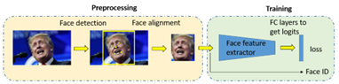
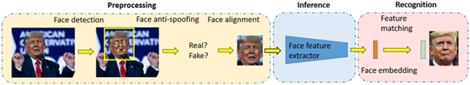
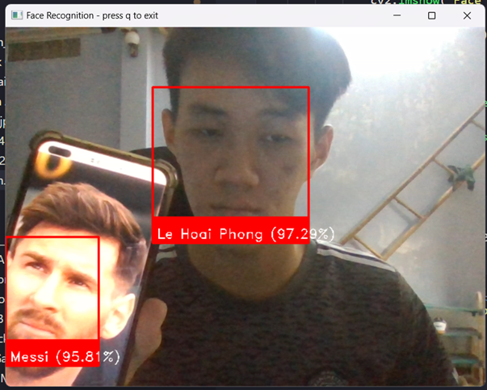
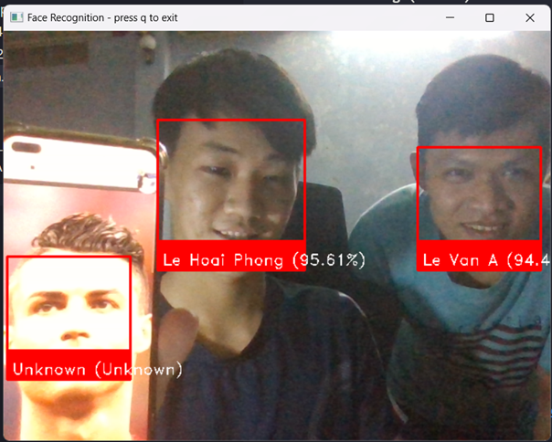

# Face Recognition System using Deep Learning

## Overview

This project focuses on building **a face recognition system** using deep learning techniques. The system is designed to recognize faces in real-time through a webcam, utilizing a combination of state-of-the-art detectors and extractors. The project compares the performance of different combinations of detectors (MTCNN, Yolov8) and feature extractors (FaceNet, VggFace) to evaluate their effectiveness in face recognition tasks.

## Features

- **Multiple Model Architectures**: Implementation of four different models by combining two detectors (MTCNN, Yolov8) with two feature extractors (FaceNet, VggFace).
- **Demo with A Real-Time Recognition App**: A simple real-time face recognition system using a webcam.
- **Transfer Learning**: Application of transfer learning to fine-tune the VggFace model for improved recognition performance.
- **Performance Evaluation**: The models are evaluated based on Accuracy, Precision, Recall, and F1-Score metrics.

## System Workflow

1. **Face Detection**: Identifying the location of faces in images or video streams.
2. **Face Alignment**: Aligning faces for consistent feature extraction.
3. **Feature Extraction**: Extracting facial features using pre-trained models (FaceNet or VggFace).
4. **Face Recognition**: Matching detected faces with known identities in a pre-compiled database.

### Training Phase:

### Inference Phase:

## Models

### 1. **Detectors**
   - **Yolov8**: A fast and efficient object detection model that identifies faces in images.
   - **MTCNN**: A multi-task cascaded convolutional network that detects faces and facial landmarks.

### 2. **Feature Extractors**
   - **FaceNet**: A deep learning model that produces 128-dimensional embeddings for each face, optimized with triplet loss.
   - **VggFace**: A deep convolutional network fine-tuned for face recognition tasks, using either ResNet-50 or SqueezeNet architectures.

## Dataset

The dataset used for training and evaluation is the **Pins Face Recognition** dataset, containing 17,534 images of 105 celebrities. The data was split into training and testing sets in an 80:20 ratio.

## Results

The following table summarizes the performance of the four models:

| Model           | Accuracy |
| --------------- | -------- |
| Yolo + VggFace  | 0.869747 |
| Yolo + FaceNet  | 0.982676 |
| MTCNN + VggFace | 0.886915 |
| MTCNN + FaceNet | **0.991540** |

**Conclusion**: The combination of MTCNN and FaceNet achieved the highest performance across all metrics, outperforming the other models. Specifically, MTCNN detected faces more accurately than Yolo, and FaceNet extracted features more effectively than VggFace.

## Real-Time Face Recognition

To demonstrate real-time face recognition, a simple application was built using the `face_recognition` library. The application detects and identifies faces in real-time using a webcam.

### Usage Instructions

1. **Prepare the Database**:
   - Place images of individuals to be recognized in a folder.
   - Each image should be named according to the person's name (e.g., `Person1.jpg`, `Person2.jpg`).

2. **Run the Application**:
   - Open the `webcam.ipynb` file.
   - Execute all cells to start the webcam.
   - Press `q` to quit the application.

**Note**: This application runs locally and cannot be executed on Google Colab due to the lack of webcam access.

### Screenshots

## Contact

For any inquiries, please contact:

- **Name**: Lê Hoài Phong
- **Email**: it.lhphong@gmail.com or hoaiphong13.11.2002@gmail.com